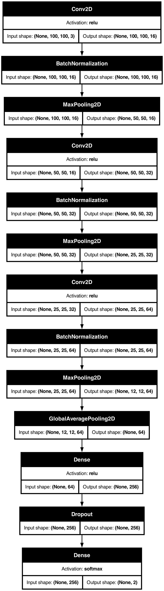
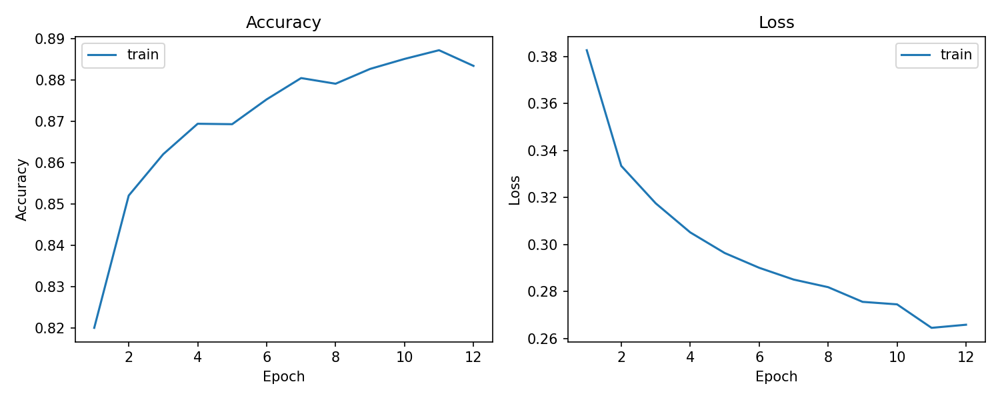
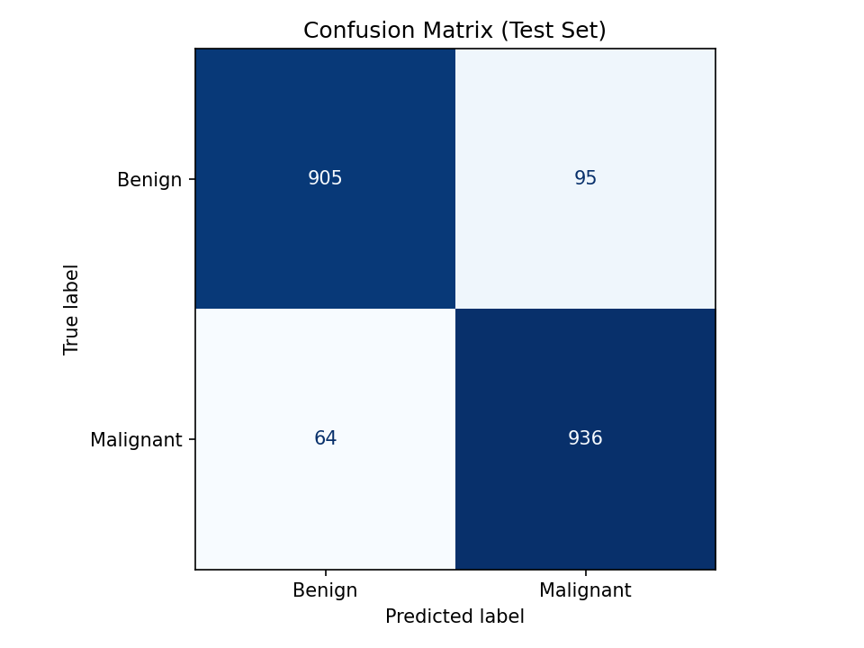

# Melanoma Classification: A Computer Vision Project
Melanoma is the deadliest form of skin cancer partly because it is difficult to distinguish from harmless sunspots and thus goes unnoticed until late in its development. My goal is to use machine learning to distinguish benign spots from melanoma more reliably than the untrained eye. 

In this project I built a convolutional neural network (CNN) to classify images of skinspots as benign or malignant with 92% accuracy on the testing set. I also built a simple Streamlit interface where users can have the model classify their own uploaded images. 
### Dataset
Kaggle dataset with 13,879 curated images of skinspots split into a training and testing set:
- Train:
    - Benign - 6289 images
    - Malignant - 5590 images
- Test:
    - Benign - 1000 images
    - Malignant - 1000 images

### Structure
 - ```train.py``` - trains a CNN on the dataset and generates performance graphs
 - ```predict.py``` - contains functions to classify user uploaded images and generate guided gradcam
 - ```app.py``` - calls functions from predict.py to display results on Streamlit frontend

## Model Architecture 
After extensive experimentation, I found that the following model architecture led to the highest accuracy and lowest loss while minimizing overfitting:



### Performance




## Limitations
- During training, all images were resized to 100x100 pixels to ensure fast training cycles, however this came at the cost of accuracy. When downsizing, fine details critical in distinguishing a benign spot from melanoma can be lost.  
- User uploaded images must display the skinspot close-up and in high resolution for the model to generate accurate results. This is a difficult job for most cellphones and is better suited for a digital camera.

## Sources
 - Melanoma dataset: https://www.kaggle.com/datasets/bhaveshmittal/melanoma-cancer-dataset/data
 - Guided gradcam implementation adapted from: https://github.com/ismailuddin/gradcam-tensorflow-2/blob/master/notebooks/GradCam.ipynb